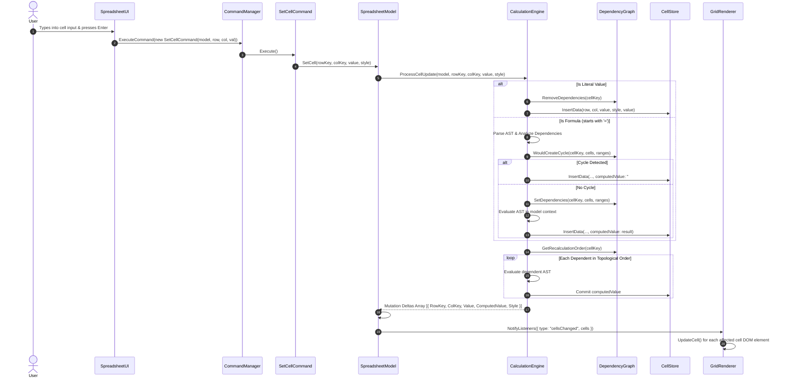
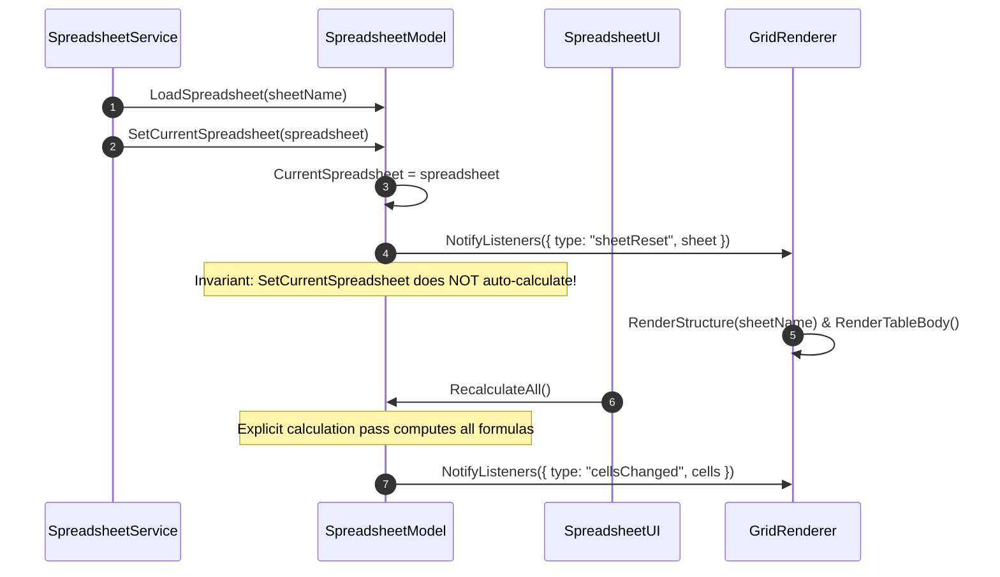

# Arbor Spreadsheet: Technical Architecture & Engineering Guide

This document provides a comprehensive technical reference for engineers working on or extending the **Arbor Spreadsheet** engine. It covers the architectural design, dependency boundaries, calculation pipeline, mutation semantics, and development invariants that govern the codebase.

---

## Table of Contents

1. [Architectural Philosophy & Core Principles](#1-architectural-philosophy--core-principles)
2. [The Two Core Invariants](#2-the-two-core-invariants)
   - [Invariant 1: Zero-DOM Boundary](#invariant-1-zero-dom-boundary)
   - [Invariant 2: Single-Notification Transaction Invariant](#invariant-2-single-notification-transaction-invariant)
3. [System Topology & Component Boundaries](#3-system-topology--component-boundaries)
4. [Data Flow & Lifecycle Walkthroughs](#4-data-flow--lifecycle-walkthroughs)
   - [Cell Mutation & Reactive Recalculation Flow](#cell-mutation--reactive-recalculation-flow)
   - [Multi-Cell Clear Flow](#multi-cell-clear-flow)
   - [Undo / Redo Flow](#undo--redo-flow)
   - [Sheet Initialization & Loading Flow](#sheet-initialization--loading-flow)
5. [The Calculation Engine Deep Dive](#5-the-calculation-engine-deep-dive)
   - [Ohm Grammar & Immutable ASTs](#ohm-grammar--immutable-asts)
   - [Dependency Extraction](#dependency-extraction)
   - [Non-Destructive Cycle Detection](#non-destructive-cycle-detection)
   - [Sub-Graph Topological Sorting (Kahn's Algorithm)](#sub-graph-topological-sorting-kahns-algorithm)
   - [Diamond DAG Duplicate Convergence](#diamond-dag-duplicate-convergence)
   - [Short-Circuit Evaluation](#short-circuit-evaluation)
6. [Mutation Batching & Transaction Semantics](#6-mutation-batching--transaction-semantics)
   - [Re-entrant Batch Depth (`_BatchDepth`)](#re-entrant-batch-depth-_batchdepth)
   - [Pending Changes Map & Latest-Snapshot-Wins](#pending-changes-map--latest-snapshot-wins)
   - [Optimized Range Clearing (`ClearCells`)](#optimized-range-clearing-clearcells)
7. [Presentation Layer & Event-Driven GridRenderer](#7-presentation-layer--event-driven-gridrenderer)
   - [Subscriber Model & Event Vocabulary](#subscriber-model--event-vocabulary)
   - [O(1) DOM Cell Updates](#o1-dom-cell-updates)
   - [Lifecycle Cleanup & Dynamic Model Rebinding](#lifecycle-cleanup--dynamic-model-rebinding)
8. [Storage Engine (`CellStore` & `AVLTree`)](#8-storage-engine-cellstore--avltree)
   - [Dual Storage Model: `Value` vs `ComputedValue`](#dual-storage-model-value-vs-computedvalue)
   - [Balanced AVL-of-AVL Trees](#balanced-avl-of-avl-trees)
9. [Developer Rules & Nuances (The "Gotchas" Guide)](#9-developer-rules--nuances-the-gotchas-guide)
10. [Automated Verification & Test Harness](#10-automated-verification--test-harness)

---

## 1. Architectural Philosophy & Core Principles

Arbor was re-architected from an early prototype where UI, state mutation, and DOM manipulation were intertwined into an enterprise-grade spreadsheet engine built upon the following pillars:

1. **Model-as-Truth**: The `SpreadsheetModel` and underlying `CellStore` represent the single authoritative source of truth. The UI and DOM elements are merely transient visual reflections of this state.
2. **Renderer-as-Subscriber**: The presentation engine (`GridRenderer`) does not own data, does not trigger calculations, and is never referenced by the model or calculation engine. It is strictly an event listener.
3. **Calculation-as-Pure-Pipeline**: Parsing, dependency analysis, cycle detection, topological sorting, and formula evaluation are pure data operations with zero side effects outside of the cell store.
4. **Command-as-Transaction**: Every user action is encapsulated as an undoable command that mutates the model through defined batch boundaries.
5. **Universal PascalCase**: Every class, method, public property, and event constant across modern modules adheres to PascalCase.

---

## 2. The Two Core Invariants

### Invariant 1: Zero-DOM Boundary

> **Rule**: No core domain module (`SpreadsheetModel`, `CalculationEngine`, `Command`, `DependencyGraph`, `FormulaEvaluator`, `FormulaParser`, `CellStore`) may reference `document`, `window.document`, `window.querySelector`, or `GridRenderer`.

```
┌──────────────────────────────────────────────────────────┐
│                   BROWSER DOM RUNTIME                    │
│   SpreadsheetUI ───► GridRenderer ───► HTMLTable / Inputs│
└───────────────────────────┬──────────────────────────────┘
                            │ (Events: cellsChanged, sheetReset)
============================▼===============================  ◄── ZERO-DOM BOUNDARY
┌──────────────────────────────────────────────────────────┐
│                 HEADLESS DOMAIN RUNTIME                  │
│                                                          │
│   CommandManager ──► Commands ──► SpreadsheetModel       │
│                                           │              │
│                                           ▼              │
│                                   CalculationEngine      │
│                                           │              │
│                                           ▼              │
│                                       CellStore          │
└──────────────────────────────────────────────────────────┘
```

#### Why This Matters

- **Pure Headless Execution**: The entire calculation and command pipeline can run seamlessly inside Node.js, Web Workers, or headless background scripts without mocking `document` or loading `jsdom`.
- **Worker Offloading**: Complex recalculation passes can be moved to dedicated Web Workers in future performance releases without changing calculation contracts.
- **Unit Test Velocity**: Core tests execute in milliseconds in standard Node.js environments.

#### Static Enforcement

The boundary is verified in CI and automated test suites (`scratch/test_decoupling.js`) by scanning all source lines of domain files for forbidden DOM tokens (`document.`, `querySelector`, `GridRenderer`).

---

### Invariant 2: Single-Notification Transaction Invariant

> **Rule**: Exactly one user command operation (single cell edit, multi-cell clear range, undo, redo) must emit **exactly one** `cellsChanged` model event containing the complete, deduplicated set of modified and cascaded cells.

```
WRONG (Fragmented Events):
User Action: ClearRange(A1:A10)
  ├── emit cellsChanged [A1]
  ├── emit cellsChanged [A2]
  ...
  └── emit cellsChanged [A10] (10 render cycles, layout thrashing)

CORRECT (Single-Notification Transaction):
User Action: ClearRange(A1:A10)
  └── emit cellsChanged [A1, A2, ..., A10, and all downstream dependents] (1 render cycle)
```

#### Why This Matters

- **Eliminates Layout Thrashing**: Emitting individual events for each cleared or recalculated cell causes the renderer to repeatedly query and mutate the DOM, freezing the browser on large selections.
- **Prevents UI Flicker / Inconsistent Frames**: Downstream dependent cells do not render intermediate partial states.
- **Clean Undo Semantics**: Undoing a compound command or multi-cell clear restores all cells and evaluates dependencies in a single atomic pass.

---

## 3. System Topology & Component Boundaries

```
                                 SpreadsheetUI
                       (Application Controller & Events)
                         │              │             │
                         ▼              │             ▼
                   CommandManager       │       SelectionModel
                         │              │     (Isolated Range State)
                         ▼              ▼
                      Commands    GridRenderer ◄── [Presentation Engine]
                         │              ▲
                         ▼              │ (SpreadsheetEvents: cellsChanged, sheetReset)
                  SpreadsheetModel ─────┘
               (Domain State & Batching)
                   │             │
                   │             ▼
                   │     CalculationEngine ◄── [Pure Calculation Coordinator]
                   │     ├── FormulaParser (Ohm Grammar & AST Builder)
                   │     ├── DependencyAnalyzer (AST -> Cells & Ranges)
                   │     ├── DependencyGraph (DAG, Cycle Detection & Topological Sort)
                   │     ├── FormulaEvaluator (Tree-Walking AST Evaluator)
                   │     ├── FunctionRegistry (SUM, AVERAGE, IF, etc.)
                   │     └── ReferenceResolver (Coordinate Mapping)
                   ▼
              Spreadsheet
                   │
                   ▼
               CellStore (Base Contract)
                   │
                   ▼
              AVLCellStore (Balanced BST-of-BSTs)
                   │
                   ▼
           SpreadsheetService & DbOps (SQLite via sql.js)
```

### Module Responsibilities

| Module                              | Architectural Role                                                                                                 | View Dependent?        |
| :---------------------------------- | :----------------------------------------------------------------------------------------------------------------- | :--------------------- |
| **`SpreadsheetUI.js`**              | Top-level controller connecting DOM event listeners (clicks, keys, inputs) to commands and models.                 | **Yes** (Browser only) |
| **`GridRenderer.js`**               | Presentation engine that generates DOM tables, handles column resizing, and updates cell elements on model events. | **Yes** (Browser only) |
| **`SelectionModel.js`**             | Pure mathematical selection state owner (row/col sets, rectangular bounding boxes).                                | **No** (Zero DOM)      |
| **`SpreadsheetModel.js`**           | Domain state coordinator, event broadcaster, and batching manager.                                                 | **No** (Zero DOM)      |
| **`CommandManager.js`**             | Bounded undo/redo history manager.                                                                                 | **No** (Zero DOM)      |
| **`Command.js`**                    | Concrete command operations (`SetCellCommand`, `ClearRangeCommand`, `CompoundCommand`).                            | **No** (Zero DOM)      |
| **`CalculationEngine.js`**          | Master calculation coordinator connecting parser, DAG, and evaluator.                                              | **No** (Zero DOM)      |
| **`DependencyGraph.js`**            | Adjacency DAG, non-destructive cycle detector, Kahn's topological sort.                                            | **No** (Zero DOM)      |
| **`FormulaParser.js`**              | Ohm-based grammar wrapper producing AST nodes.                                                                     | **No** (Zero DOM)      |
| **`FormulaAST.js`**                 | Immutable AST data structures.                                                                                     | **No** (Zero DOM)      |
| **`FormulaEvaluator.js`**           | Tree-walking formula evaluator with short-circuit logic.                                                           | **No** (Zero DOM)      |
| **`FunctionRegistry.js`**           | Registry of standard and custom spreadsheet functions.                                                             | **No** (Zero DOM)      |
| **`ReferenceResolver.js`**          | Transforms coordinate pairs `[RowKey, ColKey]` $\leftrightarrow$ `A1` cell keys.                                   | **No** (Zero DOM)      |
| **`CellStore.js` / `AVLCellStore`** | Sparse 2D storage backed by balanced AVL trees.                                                                    | **No** (Zero DOM)      |

---

## 4. Data Flow & Lifecycle Walkthroughs

### Cell Mutation & Reactive Recalculation Flow

When a user edits cell `A1` and enters a new formula or literal:



---

### Multi-Cell Clear Flow

When a user selects a range (e.g. `A1:B10`) and presses `Delete`:

1. `SpreadsheetUI` captures `Delete` key and creates `ClearRangeCommand(model, selectedEntries)`.
2. `CommandManager.ExecuteCommand(command)` calls `command.Execute()`.
3. `ClearRangeCommand.Execute()` captures prior cell values/styles for undo, then calls `model.ClearCells(entries)`.
4. `SpreadsheetModel.ClearCells(entries)` delegates directly to `CalculationEngine.ClearCells(model, entries)`:
   - For all cleared cells: sets store values to `""`, deletes dependencies from `DependencyGraph`, and purges `FormulaCache`.
   - Gathers all cleared cell keys (`[A1, A2, ..., B10]`).
   - Runs `DependencyGraph.GetRecalculationOrder(clearedKeys)` in **one single pass**.
   - Evaluates all downstream dependents topologically in **one pass**.
   - Assembles a unified deduplicated delta array containing all cleared cells plus all affected dependents.
5. `SpreadsheetModel` records the unified delta and emits **exactly one** `cellsChanged` event.
6. `GridRenderer` updates the DOM inputs and cells in $O(1)$ operations per cell.

---

### Undo / Redo Flow

When a user presses `Ctrl+Z` to undo the multi-cell clear:

1. `CommandManager.Undo()` pops `ClearRangeCommand` from `UndoStack`.
2. `ClearRangeCommand.Undo()` executes within a batch transaction:
   ```javascript
   this.SpreadsheetModel.BatchUpdate(() => {
   	for (const entry of this.CellEntries) {
   		this.SpreadsheetModel.SetCell(
   			entry.RowKey,
   			entry.ColKey,
   			entry.OldValue,
   			entry.OldStyle || {},
   		);
   	}
   });
   ```
3. `SpreadsheetModel.BatchUpdate`:
   - Increments `_BatchDepth` from 0 to 1.
   - Each `SetCell` evaluates its dependencies and stages mutations into `_PendingChanges` Map without firing events.
   - Restoring multiple cells that share downstream dependents will overwrite the pending snapshot in `_PendingChanges` with the latest evaluated value.
   - `EndBatch()` decrements `_BatchDepth` back to 0.
4. Exactly **one** `cellsChanged` event is broadcast containing the restored cells and their recalculated dependents.
5. `SpreadsheetModel.Undo()` wraps the undo operation in `this.BatchUpdate(...)`.
6. `CommandManager.Undo()` pops `ClearRangeCommand` from `UndoStack`.
7. `ClearRangeCommand.Undo()` delegates to `this.SpreadsheetModel.RestoreCells(this.CellEntries)`.
8. `CalculationEngine.RestoreCells(model, entries)` executes in two phases:
   - **Phase 1 (Storage & Dependency Registration)**: Iterates entries once, commits all raw values and styles to the cell store, rebuilds formula dependencies in `DependencyGraph`, and registers formula ASTs in `FormulaCache`.
   - **Phase 2 (Single Unified Recalculation Pass)**: Identifies all restored formula keys, recovered circular formula keys, and downstream dependent cells, computing a single topological recalculation order via `DependencyGraph.GetRecalculationOrder`.
9. Staged changes are recorded into `SpreadsheetModel._PendingChanges`.
10. When `BatchUpdate` completes, exactly **one** `cellsChanged` event is broadcast containing the restored cells and their recalculated dependents.

---

### Sheet Initialization & Loading Flow

When a sheet is loaded from the database or created fresh:



---

## 5. The Calculation Engine Deep Dive

### Ohm Grammar & Immutable ASTs

Formulas are parsed using an Ohm grammar (`ohm.min.js`) defined in [`FormulaParser.js`](file:///home/shashi/Desktop/WorkingArea/Spreadsheet/FormulaParser.js). The Ohm concrete syntax tree (CST) is converted into immutable AST nodes defined in [`FormulaAST.js`](file:///home/shashi/Desktop/WorkingArea/Spreadsheet/FormulaAST.js):

- `NumberNode(value)`: Literals like `42`, `3.14`.
- `StringNode(value)`: Text strings `"hello"`.
- `BooleanNode(value)`: `TRUE` or `FALSE`.
- `CellReferenceNode(rawReference, colKey, rowKey)`: Single cell references (`A1`, `B5`).
- `RangeNode(rawReference, startCol, startRow, endCol, endRow)`: 2D rectangular references (`A1:C10`).
- `UnaryOpNode(operator, operand)`: Negation (`-A1`) or positive (`+5`).
- `BinaryOpNode(operator, left, right)`: Arithmetic (`+`, `-`, `*`, `/`, `^`) and comparisons (`=`, `<>`, `<`, `<=`, `>`, `>=`).
- `FunctionCallNode(functionName, args)`: Excel functions (`SUM(A1:A5)`, `IF(...)`).
- `ErrorNode(errorMessage)`: Syntax errors (`#ERROR!`).

AST nodes are **strictly immutable**. They can be safely cached in `CalculationEngine.FormulaCache` (`Map<cellKey, { AST, RawFormula }>`) and reused across multiple recalculation passes without re-parsing.

---

### Dependency Extraction

[`DependencyAnalyzer.js`](file:///home/shashi/Desktop/WorkingArea/Spreadsheet/DependencyAnalyzer.js) implements the Visitor pattern to extract dependencies from an AST:

- **`Cells: Set<string>`**: Extracted from all `CellReferenceNode` instances.
- **`Ranges: RangeNode[]`**: Extracted from all `RangeNode` instances (e.g. `SUM(A1:B5)`).

---

### Non-Destructive Cycle Detection

Before any dependency edge is added to the graph, [`DependencyGraph.WouldCreateCycle`](file:///home/shashi/Desktop/WorkingArea/Spreadsheet/DependencyGraph.js#L170) is called:

```javascript
WouldCreateCycle(
	targetCellKey,
	proposedCellDependencies,
	proposedRangeDependencies,
);
```

1. **Self-Reference Check**: If `proposedCellDependencies` contains `targetCellKey`, or if `targetCellKey` lies within any `proposedRangeDependencies` bounding box, return `true` immediately.
2. **Downstream Reachability Check**:
   - Performs a Depth-First Search (DFS) starting from `targetCellKey` using existing downstream dependent edges.
   - If any proposed precedent cell or range cell is reachable downstream from `targetCellKey`, adding the edge would introduce a directed cycle. Return `true`.
   - **Crucial Invariant**: During this check, **no graph edges are mutated**. If a cycle is detected, the graph remains 100% clean and consistent.
3. If `WouldCreateCycle` returns `true`, `CalculationEngine` sets the cell value to `#CIRCULAR!` and does not register the invalid dependencies.
4. If `WouldCreateCycle` returns `true`, `CalculationEngine` sets the cell value to `#CIRCULAR!`, records the blocked AST in `this.CircularFormulas`, and does not register the invalid dependencies.

---

### Dynamic Cycle Recovery (`CircularFormulas`)

A critical challenge in reactive spreadsheet calculation is circular dependency recovery. When a circular cycle is established (e.g. `A1 = =B1`, `B1 = =C1`, `C1 = =A1`), `C1` cannot register `A1` as a precedent without creating a directed loop.

If `A1` is later overwritten with a constant literal (e.g. `A1 = 10`), the cycle is broken. In naïve engines, `C1` would remain stuck as `#CIRCULAR!` permanently unless manually re-typed.

Arbor solves this via `CalculationEngine.CircularFormulas`:

1. When a formula triggers `WouldCreateCycle`, it is saved in `this.CircularFormulas = new Map()`.
2. On every cell mutation (`ProcessCellUpdate`, `ClearCells`, `RestoreCells`), `#RecoverCircularFormulas(model)` loops through `CircularFormulas` and re-checks `WouldCreateCycle(key, cells, ranges)`.
3. If the cycle is broken:
   - The recovered formula is deleted from `CircularFormulas`.
   - Its dependencies are restored into `DependencyGraph.SetDependencies`.
   - Its AST is cached in `FormulaCache`.
   - It is included in the downstream topological recalculation pass.
4. Cells automatically transition from `#CIRCULAR!` back to valid numeric or string results.

---

### Sub-Graph Topological Sorting (Kahn's Algorithm)

When cell `A1` changes, only the cells that transitively depend on `A1` need recalculation. Recalculating the entire sheet would be $O(N)$ and unacceptable for large sheets.

[`DependencyGraph.GetRecalculationOrder(changedCellKeys)`](file:///home/shashi/Desktop/WorkingArea/Spreadsheet/DependencyGraph.js#L307) executes Kahn's algorithm restricted to the affected subgraph:

1. **Subgraph Discovery**: Breadth-First Search (BFS) starts at `changedCellKeys` and collects all reachable downstream dependents into an `affected` Set.
2. **In-Degree Calculation**: Calculates in-degrees strictly within the `affected` subgraph.
3. **Queue Initialization**: Seeds `readyQueue` with cells whose in-degree within the subgraph is 0 (i.e. their only precedents are the cells that just changed).
4. **Topological Order Processing**: Dequeues each cell, appends to `Order`, and decrements the in-degree of its dependents. Any dependent reaching in-degree 0 is queued.
5. **Downstream Cycle Detection**: If the processed count does not equal `affected.size`, remaining cells with in-degree > 0 are identified as `CircularCells`.

---

### Diamond DAG Duplicate Convergence

In a diamond dependency graph:

```
        A1
       /  \
      ▼    ▼
     B1    C1
      \   /
       ▼ ▼
        D1
```

- When `A1` is mutated:
  - Both `B1` and `C1` depend directly on `A1`.
  - `D1` depends on both `B1` and `C1`.
- **Topological Guarantee**: Kahn's algorithm guarantees that `D1` appears in `Order` **after both `B1` and `C1`** have been evaluated.
- **Single Evaluation Guarantee**: `D1` appears **exactly once** in `Order`. It is evaluated only after both of its upstream branches have completed, avoiding redundant recalculations and intermediate flicker.

---

### Short-Circuit Evaluation

In [`FormulaEvaluator.js`](file:///home/shashi/Desktop/WorkingArea/Spreadsheet/FormulaEvaluator.js):

- **`IF(condition, trueExpr, falseExpr)`**:
  - The condition is evaluated first.
  - If truthy, `trueExpr` is evaluated and `falseExpr` is **never visited**.
  - If falsy, `falseExpr` is evaluated and `trueExpr` is **never visited**.
  - _Example_: `=IF(A1 = 0, 0, 100 / A1)` safely avoids division by zero `#DIV/0!` when `A1` is 0.
- **`IFERROR(expr, fallback)`**:
  - Evaluates `expr`.
  - If the result is an error string (`#ERROR!`, `#DIV/0!`, `#CIRCULAR!`, `#REF!`, `#NAME?`), evaluates and returns `fallback`.
  - Otherwise, returns the evaluated result without ever touching `fallback`.

---

## 6. Mutation Batching & Transaction Semantics

### Re-entrant Batch Depth (`_BatchDepth`)

`SpreadsheetModel` implements re-entrant batching to allow commands and workflows to nest batch operations safely without premature event emission:

```javascript
BeginBatch() {
    this._BatchDepth++;
}

EndBatch() {
    if (this._BatchDepth > 0) {
        this._BatchDepth--;
    }
    if (this._BatchDepth === 0 && this._PendingChanges.size > 0) {
        const cells = Array.from(this._PendingChanges.values());
        this._PendingChanges.clear();
        this.NotifyListeners({
            type: SpreadsheetEvents.CellsChanged,
            cells,
        });
    }
}
```

- `BeginBatch()` increments `_BatchDepth`.
- `EndBatch()` decrements `_BatchDepth`.
- Only when `_BatchDepth === 0` are all staged pending changes flushed to listeners.

---

### Pending Changes Map & Latest-Snapshot-Wins

Inside `SpreadsheetModel.#RecordChanges(deltaArray)`:

- Each modified or recalculated cell is keyed by its coordinate identifier:
  `const key = resolver.CoordsToCellKey(cell.RowKey, cell.ColKey);`
- Stored into `_PendingChanges.set(key, cell);`.
- If a cell is mutated or recalculated multiple times during a single batch transaction (e.g. intermediate steps in a compound operation), the map automatically deduplicates entries. The **latest snapshot wins**, guaranteeing that subscribers only receive the final, settled state.

---

### Optimized Range Clearing (`ClearCells`)

`ClearCells` avoids the catastrophic performance trap of iterating and recalculating cell-by-cell:

```javascript
// WRONG (Naïve approach: O(N) recalculation passes):
for (const entry of cellEntries) {
	model.SetCell(entry.RowKey, entry.ColKey, ""); // Recalculates DAG N times!
}

// CORRECT (Arbor approach: 1 recalculation pass):
CalculationEngine.ClearCells(model, entries);
```

1. **Storage Clearing**: All cleared cells are written to `""` in the cell store in $O(M)$ time.
2. **Graph Invalidation**: Dependencies for all cleared cells are deleted from the DAG.
3. **Unified Recalculation**: All cleared cell keys are passed to `RecalculateDependents` simultaneously.
4. **Single Event**: All cleared cells and all affected downstream cells are combined into a single delta array and broadcast in **one** event.

---

### Bulk Multi-Cell Restoration (`RestoreCells`)

Similarly to clearing, undoing a multi-cell clear operation must not perform $N$ sequential `SetCell` invocations. Doing so would trigger $N$ separate topological traversals and evaluations:

```javascript
// WRONG (Naïve approach: N recalculation passes in undo):
for (const entry of cellEntries) {
	model.SetCell(entry.RowKey, entry.ColKey, entry.OldValue, entry.OldStyle);
}

// CORRECT (Arbor approach: 1 bulk pass):
model.RestoreCells(this.CellEntries);
```

[`CalculationEngine.RestoreCells(model, entries)`](file:///home/shashi/Desktop/WorkingArea/Spreadsheet/CalculationEngine.js#L505) executes in two phases:

1. **Phase 1 (Storage & Dependency Registration)**:
   - For literal values: writes values and styles into the store, removes previous dependencies, and caches change descriptors.
   - For formulas: parses the AST, validates cycle constraints, registers DAG dependencies (`Graph.SetDependencies`), caches the AST, and commits the formula to storage.
   - Re-evaluates `CircularFormulas` to recover any cycles resolved by the restored data.
2. **Phase 2 (Single Unified Recalculation Pass)**:
   - Identifies all restored formulas, recovered formulas, and downstream dependent cells.
   - Runs Kahn's topological sort once across the entire union of affected cells.
   - Evaluates each cell in exact topological order and commits the result to storage.
   - Returns a single, complete mutation delta array containing all restored cells and affected dependents.

---

## 7. Presentation Layer & Event-Driven GridRenderer

### Subscriber Model & Event Vocabulary

`SpreadsheetModel` exports a frozen event vocabulary:

```javascript
const SpreadsheetEvents = Object.freeze({
	CellsChanged: "cellsChanged",
	SheetReset: "sheetReset",
});
```

`GridRenderer` subscribes to the model upon construction:

```javascript
constructor(containerElement, spreadsheetModel, selectionModel) {
    ...
    this.ModelListener = (event) => this.OnModelEvent(event);
    this._SpreadsheetModel = null;
    this.SpreadsheetModel = spreadsheetModel;
}
```

---

### O(1) DOM Cell Updates

When `GridRenderer` receives a `cellsChanged` event:

```javascript
OnModelEvent(event) {
    if (event.type === "cellsChanged" && Array.isArray(event.cells)) {
        for (const cell of event.cells) {
            const displayValue =
                cell.ComputedValue !== undefined && cell.ComputedValue !== null
                    ? cell.ComputedValue
                    : (cell.Value ?? "");
            this.UpdateCell(cell.RowKey, cell.ColKey, displayValue, cell.Style);
        }
    }
}
```

`UpdateCell` accesses the specific `<input>` element via pre-indexed data attributes (`data-rowno`, `data-colno`) and updates its `.value` and `.style` in $O(1)$ time. No table rebuilding or DOM tree replacement takes place.

---

### Lifecycle Cleanup & Dynamic Model Rebinding

If a `GridRenderer` is destroyed or attached to a different model:

- **`Destroy()`**: Calls `this.SpreadsheetModel.RemoveListener(this.ModelListener)` to prevent memory leaks and dangling subscriber callbacks.
- **Model Setter**: Rebinding `renderer.SpreadsheetModel = newModel` automatically detaches the listener from the old model and attaches to the new model.
- **`Destroy()`**: Calls `this.SpreadsheetModel.RemoveListener(this.ModelListener)`, sets `this._SpreadsheetModel = null`, and nulls `this.ModelListener` to prevent memory leaks and dangling subscriber callbacks.
- **Model Setter**: Rebinding `renderer.SpreadsheetModel = newModel` automatically detaches the listener from the old model (if any), re-instantiates `this.ModelListener` if null, and registers the listener with the new model.

---

## 8. Storage Engine (`CellStore` & `AVLTree`)

### Dual Storage Model: `Value` vs `ComputedValue`

Every cell in Arbor maintains two distinct values:

1. **`Value`**: The raw user input. Can be a string literal (`"Hello"`), a numeric literal (`42`), or a formula string (`"=A1 * 2"`).
2. **`ComputedValue`**: The evaluated result. Computed by `CalculationEngine`. Can be a number (`84`), string, boolean, or error token (`#DIV/0!`, `#CIRCULAR!`, `#ERROR!`).

#### UI Interaction Nuance

- **Normal Display**: The grid cell input displays `ComputedValue`.
- **Edit Mode (`focusin`)**: When a user clicks or focuses an input, `SpreadsheetUI` temporarily swaps the display to `Value` so the user can see and edit the formula syntax.
- **Commit Mode (`focusout` / `Enter`)**: When focus leaves, the display swaps back to `ComputedValue`.

---

### Balanced AVL-of-AVL Trees

Storage is implemented in [`Datastructure.js`](file:///home/shashi/Desktop/WorkingArea/Spreadsheet/Datastructure.js) and wrapped by [`CellStore.js`](file:///home/shashi/Desktop/WorkingArea/Spreadsheet/CellStore.js):

- Outer AVL tree indexed by `ColKey`. Each node is a `ColumnNode`.
- Each `ColumnNode` holds an inner AVL tree indexed by `RowKey`. Each node is a `RowNode`.
- Guarantees $O(\log C + \log R)$ insertion, lookup, and deletion performance.
- Memory consumption is strictly proportional to the number of non-empty cells (sparse storage).

---

## 9. Developer Rules & Nuances (The "Gotchas" Guide)

When writing new features, formulas, or commands for Arbor, observe these non-negotiable rules:

### Rule 1: Universal PascalCase

All class names, method names, public properties, and exported event constants MUST be PascalCase.

- **CORRECT**: `model.SetCell(...)`, `model.GetCellValue(...)`, `SpreadsheetEvents.CellsChanged`
- **WRONG**: `model.setCell(...)`, `model.get_cell_value(...)`, `SpreadsheetEvents.cellsChanged`

### Rule 2: Never Touch the DOM in Core Modules

Never use `document`, `window`, or `GridRenderer` inside `SpreadsheetModel.js`, `Command.js`, or `CalculationEngine.js`.

- If your command needs to update the screen, **do nothing in the command**. Mutate the model; the model will notify `GridRenderer` automatically.

### Rule 3: Always Batch Multi-Cell Operations

Never execute multiple `SetCell` calls in a loop without batching.

- **CORRECT**:
  ```javascript
  model.BatchUpdate(() => {
  	for (const item of items) {
  		model.SetCell(item.r, item.c, item.val);
  	}
  });
  ```
- **For Bulk Restorations**: Use `model.RestoreCells(entries)` rather than looping `SetCell`. `RestoreCells` performs a single bulk storage write and a single topological recalculation pass across the entire set.
- **WRONG**: Calling `model.SetCell` repeatedly without `BatchUpdate` causes redundant DAG recalculation and emits multiple `cellsChanged` events.

### Rule 4: Zero Implicit Recalculation on Sheet Assignment

`SetCurrentSpreadsheet` resets the sheet and emits `sheetReset`. It does **not** recalculate formulas automatically. Explicitly call `model.RecalculateAll()` when loading a sheet into the UI.

### Rule 5: Keep AST Nodes Pure and Immutable

Never attach runtime state, evaluation flags, or execution counters directly to AST nodes. Evaluation state belongs in the evaluator or calculation engine.

### Rule 6: Support Both Column Formats via `ReferenceResolver`

Column keys can be 0-based integers (`0`, `1`, `2`) or Excel letter names (`"A"`, `"B"`, `"AA"`). Always normalize column keys using `ReferenceResolver.ToColumnIndex(colKey)`.

---

## 10. Automated Verification & Test Harness

Arbor maintains automated test suites in the `scratch/` directory:

| Test Suite                       | Purpose                                                                                                                                                                       |
| :------------------------------- | :---------------------------------------------------------------------------------------------------------------------------------------------------------------------------- |
| **`scratch/test_decoupling.js`** | **Commit 1 Verification**: Enforces Zero-DOM static boundaries, Single-Notification transactions, diamond DAG duplicate convergence, nested batching, and renderer lifecycle. |
| **`scratch/test_slice9.js`**     | Calculation engine, reactive cascading, error propagation, cycle recovery, and full regression across slices 1-8.                                                             |
| **`scratch/test_slice8.js`**     | Directed Acyclic Graph (DAG) construction, cycle validation, and Kahn's topological sort.                                                                                     |
| **`scratch/test_slice7.js`**     | Short-circuit evaluation for `IF`, `IFERROR`, and logical operators (`AND`, `OR`, `NOT`).                                                                                     |
| **`scratch/test_slice6.js`**     | Comparison operators (`=`, `<>`, `<`, `<=`, `>`, `>=`) and boolean evaluation.                                                                                                |
| **`scratch/test_slice4.js`**     | 2D rectangular ranges and aggregate functions (`SUM`, `AVERAGE`, `MIN`, `MAX`, `COUNT`, `COUNTA`).                                                                            |
| **`scratch/test_slice3.js`**     | Exponentiation (`^`) right-associativity and unary operator precedence.                                                                                                       |
| **`scratch/test_slice2.js`**     | Cell reference resolution and coordinate transformation mapping.                                                                                                              |
| **`scratch/test_slice1.js`**     | Basic arithmetic expressions and operator precedence (`+`, `-`, `*`, `/`).                                                                                                    |
| **`scratch/test_db_save.js`**    | SQLite WebAssembly persistence, bulk serialization, and schema provisioning.                                                                                                  |

To run the entire suite:

```bash
# Verify architectural boundaries and invariants
node scratch/test_decoupling.js

# Verify calculation engine and full regression
node scratch/test_slice9.js
```
